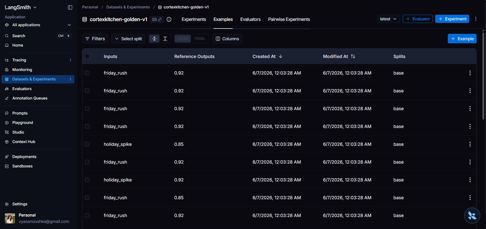
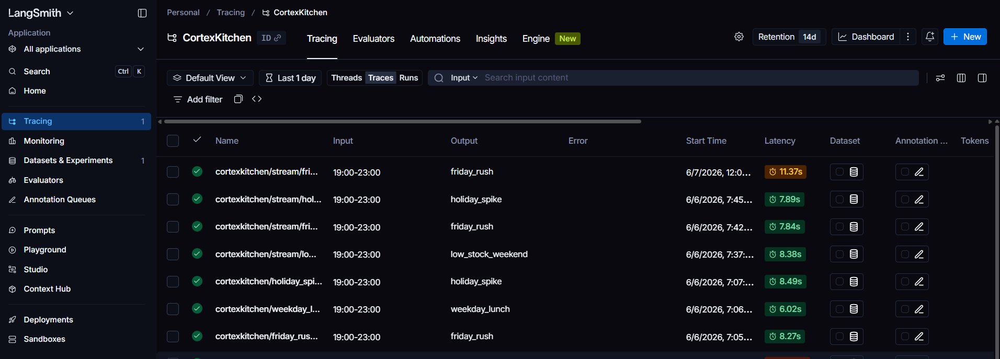
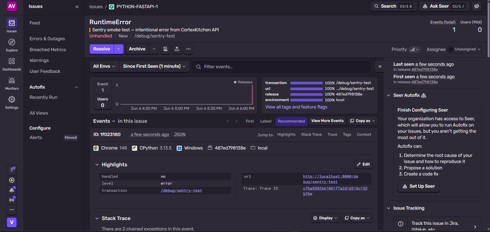

# CortexKitchen

**Multi-agent restaurant operations intelligence platform**


---

## What is CortexKitchen?

CortexKitchen is a multi-agent AI platform for restaurant operations. Before every shift, five specialist agents read your demand data, bookings, guest complaints, menu performance, and inventory — in parallel — and produce a single verified pre-shift brief.

A critic agent reviews the plan across five quality dimensions before it reaches the manager. If anything looks unsafe or unrealistic, the plan is blocked and the reason is explained.

The result: one brief, one verdict, under 90 seconds.


---

## How it works

One planning run executes a nine-node LangGraph pipeline:

1. **Ops Manager** — validates the scenario, initialises shared state, fans out work
2. **Demand Forecast** — Prophet time-series model produces covers, peak hour, and confidence band
3. **Bookings & Tables** — analyses reservation density, occupancy %, and waitlist pressure *(parallel)*
4. **Guest Feedback** — RAG retrieval over Qdrant surfaces complaint patterns and SOPs *(parallel)*
5. **Menu Intelligence** — evaluates top items, weak items, and promotion opportunities *(parallel)*
6. **Stock & Inventory** — detects shortages, spoilage risk, and restock priorities *(parallel)*
7. **Aggregator** — collects all domain outputs into a single package
8. **Quality Check (Critic)** — scores the plan across 5 dimensions, gates it with a verdict
9. **Final Assembler** — shapes the API response with full metadata and cost tracking


---

## Platform capabilities

### Planning & Intelligence
- **Multi-scenario planning** — four presets: `friday_rush`, `weekday_lunch`, `holiday_spike`, `low_stock_weekend`
- **Demand forecasting** — Prophet-backed time-series with peak detection and day-of-week adjustment
- **Complaint intelligence (RAG)** — Qdrant retrieval grounds recommendations in real past guest issues
- **Menu guidance** — push / ease-back / avoid strategy aligned to demand and stock signals
- **Inventory risk detection** — shortage and overstock alerts with feasibility-aware planning
- **Critic quality gate** — 5-dimension scoring (safety, feasibility, evidence, actionability, clarity); three verdicts: approved / revision / rejected


### Streaming & Real-time
- **SSE streaming** — node-by-node results streamed to the frontend as each agent completes; no waiting for the full pipeline
- **Live pipeline diagram** — visual node status (done / running / waiting) during every run
- **Redis caching** — 1-hour TTL cache by scenario + date; zero LLM cost on cache hits; `cache_hit` flag in response

### Exports
- **PDF chef brief** — ReportLab-generated report with plan summary, agent outputs, critic verdict, dimension scores, and action items
- **Excel workbook** — role-aware `.xlsx` with an Inventory & Staffing sheet (chef view) and a Cost Breakdown sheet (owner view)


### Ask AI (RAG Chatbot)
- **Conversational interface** over your actual run history, inventory data, and guest feedback — not generic AI
- **Groq llama-3.3-70b** with SSE streaming responses
- **Multi-turn memory** — follow-up questions understand prior context
- Suggested questions surface on first load; answers cite your own data


### What-If Simulator
- Slide covers, date, or scenario — cost pressure, benefit score, and tradeoff indicators update instantly
- No extra LLM call — partial LangGraph execution for instant feedback


### Run History & Audit Trail
- Full run history with critic score trend chart, scenario filter, and date range picker
- Side-by-side run detail with critic dimension scores, RAG context, and full agent outputs
- Every run persisted permanently with token count, LLM cost, and node-level latency


### Data Health & Observability
- **Data Health page** — live database coverage: orders, reservations, feedback, inventory, menu items, scenario coverage
- **Observability panel** — 7-day planning summary: total runs, success rate, avg critic score, avg duration, breakdown by verdict and scenario
- **OpenTelemetry** — HTTP request tracing on every endpoint
- **Prometheus** — `/metrics` scrape endpoint for latency, throughput, and error rate
- **Sentry** — unhandled exception capture with LangGraph node tags for fast debugging


### LangSmith Regression Evals
- **Golden dataset** — `cortexkitchen-golden-v1` with 50 curated planning runs across all scenarios
- **CI quality gate** — automated evaluators require 90% pass rate; failing the gate blocks deployment
- **Per-node traces** in LangSmith for every planning run in production







### Multi-Tenant Workspace Isolation
- JWT authentication with org-scoped planning runs, settings, and profiles
- PostgreSQL `org_id` scoping on all run queries
- Qdrant payload filter per org on complaint and SOP vectors
- `org_id` carried through `OrchestratorState` for end-to-end isolation

### Configuration
- **Workspace settings** — seating capacity, cuisine type, peak service hours, timezone, plan approval threshold, stock warning levels
- **Restaurant profiles** — named profiles override org-level capacity and peak hours per run


### MCP Server
- `run_planning_scenario` and `get_run_history` tools via Anthropic MCP SDK
- Auto-discovered by Claude Code via `.mcp.json` in the project root
- Trigger real planning runs from natural language in Claude Code CLI or Claude Desktop

---

## Product surface

| Page | URL | Purpose |
|------|-----|---------|
| Homepage | `/` | Public marketing page — pipeline explainer, features, CTA |
| Login | `/login` | JWT sign-in |
| Register | `/register` | Create workspace + org |
| Dashboard | `/dashboard` | Scenario selection, run submission, streaming pipeline, full plan, what-if |
| Runs | `/runs` | Run history, critic score trend, run detail, PDF/Excel export |
| Ask AI | `/chat` | RAG chatbot over run history and feedback |
| Data Health | `/data-health` | Database coverage + observability panel |
| Settings | `/settings` | Workspace configuration and planning thresholds |
| Restaurant Profiles | `/restaurant-profiles` | Named restaurant profiles |


---

## System architecture

| Layer | Technology |
|-------|-----------|
| Backend API | FastAPI 0.115, Uvicorn, Pydantic v2 |
| Orchestration | LangGraph (StateGraph, nine nodes, parallel fan-out) |
| LLM | Groq llama-3.3-70b (default) or Gemini — pluggable via `LLM_PROVIDER`; auto-fallback |
| Streaming | FastAPI SSE — node-by-node results via fetch ReadableStream |
| Caching | Redis 7 — 1hr TTL plan cache by scenario + date |
| Database | PostgreSQL 16 via SQLAlchemy + Alembic |
| Vector store | Qdrant — complaints and SOPs, org-scoped payload filters |
| Forecasting | Prophet + Pandas |
| Frontend | Next.js 16, React 19, TypeScript, Tailwind CSS 4, Recharts |
| Auth | JWT (HS256) + passlib/bcrypt — multi-tenant, org-scoped |
| Observability | LangSmith tracing, OTel HTTP tracing, Prometheus /metrics, Sentry, structlog JSON |
| Evals | LangSmith golden dataset (50 runs, 90% CI gate), RAGAS, DeepEval |
| Exports | ReportLab (PDF), openpyxl (Excel) |
| MCP | Anthropic MCP SDK — `run_planning_scenario` + `get_run_history` |
| Local infra | Docker Compose (PostgreSQL, Qdrant, Redis) |

---

## Project status

| Phase | Status | Highlights |
|-------|--------|-----------|
| Phase 0 | Complete | Architecture, PRD, system design, data model, API contracts |
| Phase 1 | Complete | FastAPI, LangGraph 9-node graph, all domain services, dashboard |
| Phase 2 | Complete | Prophet forecasting, inventory alerts, menu intelligence |
| Phase 3 | Complete | Multi-scenario runner, runs audit trail, critic scoring |
| Phase 4 | Complete | Auth, LangSmith, health checks, structlog, cost tracking, evals, MCP |
| Phase 5 | **Complete** | PDF/Excel export, SSE streaming, Redis cache, what-if simulator, OTel, Sentry, LangSmith evals, multi-tenant isolation, RAG chatbot, prelaunch polish |

---

## Repository structure

```
apps/
  api/                          # FastAPI backend
    app/
      api/routes/               # Auth, planning, runs, settings, exports, chat, observability
      domain/services/          # ForecastService, ComplaintService, MenuService, etc.
      orchestration/            # LangGraph graph, nodes, state
      infrastructure/           # DB, LLM providers, Qdrant, Redis, OTel, Sentry
    evals/                      # RAGAS + DeepEval quality eval suites
    scripts/                    # Golden dataset builder (build_golden_dataset.py)
    mcp_server.py               # MCP stdio server for Claude integration
  web/cortexkitchen-ui/         # Next.js 16 frontend
    app/                        # Pages: dashboard, runs, chat, data-health, settings, etc.
    components/                 # NavBar, Footer, ForecastChart, layout
    hooks/                      # useFridayRush, streaming hooks

data/                           # Raw, processed, and seeded datasets
docs/                           # Architecture, API reference, agents, roadmap, evaluation
infra/                          # Local infrastructure setup
scripts/                        # seed_demo_data.py, seed_qdrant_memory.py
screenshots/                    # Feature screenshots organized by section
docker-compose.yml              # Local stack: PostgreSQL, Qdrant, Redis
.mcp.json                       # Claude Code MCP auto-discovery config
```

---

## Local setup

### Prerequisites

- Docker and Docker Compose
- Python 3.11+
- Node.js 18+
- Groq API key — free at [console.groq.com](https://console.groq.com)

### 1. Start infrastructure

```bash
docker compose up -d
```

Starts PostgreSQL 16 (port 5432), Qdrant (port 6333), and Redis 7 (port 6379).

### 2. Configure the backend

```bash
cd apps/api
cp .env.example .env
```

Edit `.env`:

```env
LLM_PROVIDER=groq
GROQ_API_KEY=your_groq_key_here

# Optional — Gemini used as fallback when Groq fails
GEMINI_API_KEY=your_gemini_key_here

JWT_SECRET_KEY=change-me-in-production

# Optional — enables LangSmith per-node tracing
LANGCHAIN_TRACING_V2=true
LANGCHAIN_API_KEY=your_langsmith_key

# Optional — enables Sentry exception capture
SENTRY_DSN=your_sentry_dsn
```

### 3. Install and seed

```bash
cd apps/api
python -m venv venv

# Windows
venv\Scripts\activate
# macOS / Linux
source venv/bin/activate

pip install -r requirements.txt
alembic upgrade head
python ..\..\scripts\seed_demo_data.py
python ..\..\scripts\seed_qdrant_memory.py
```

### 4. Start the backend

```bash
uvicorn app.main:app --reload
```

API at `http://localhost:8000` · Swagger at `http://localhost:8000/docs`

### 5. Start the frontend

```bash
cd apps/web/cortexkitchen-ui
npm install
npm run dev
```

Frontend at `http://localhost:3000`

### 6. Register and log in

Go to `http://localhost:3000/register`, create your workspace, then log in. All planning routes are auth-protected and org-scoped.

---

## API surface

| Method | Endpoint | Auth | Description |
|--------|----------|------|-------------|
| `POST` | `/api/v1/auth/register` | Public | Register user + org |
| `POST` | `/api/v1/auth/login` | Public | Get JWT access token |
| `GET` | `/api/v1/health` | Public | Liveness check |
| `GET` | `/api/v1/health/dependencies` | Public | PostgreSQL, Qdrant, Redis status |
| `GET` | `/api/v1/planning/scenarios` | Public | List scenario presets |
| `POST` | `/api/v1/planning/run` | JWT | Execute planning pipeline (SSE stream) |
| `GET` | `/api/v1/runs` | JWT | List persisted runs |
| `GET` | `/api/v1/runs/{id}` | JWT | Run detail |
| `GET` | `/api/v1/runs/{id}/export/pdf` | JWT | Download PDF chef brief |
| `GET` | `/api/v1/runs/{id}/export/excel` | JWT | Download Excel workbook |
| `POST` | `/api/v1/chat` | JWT | RAG chatbot over run history (SSE stream) |
| `GET` | `/api/v1/observability/summary` | JWT | 7-day planning summary stats |
| `GET` | `/api/v1/settings` | JWT | Get org settings |
| `PUT` | `/api/v1/settings` | JWT | Update org settings |
| `GET/POST/PUT/DELETE` | `/api/v1/restaurant-profiles` | JWT | Restaurant profile CRUD |
| `GET` | `/metrics` | Public | Prometheus scrape endpoint |
| `GET` | `/api/v1/debug/sentry-test` | Public | Sentry smoke test |

See [`docs/APIS.md`](docs/APIS.md) for full request/response schemas.

---

## MCP integration

The `.mcp.json` in the project root wires up the MCP server automatically in Claude Code.

Set `CORTEX_EMAIL` and `CORTEX_PASSWORD` in `.mcp.json` to a registered user, then:

```
run a friday rush planning scenario
show me the last 5 planning runs filtered to approved verdicts
```

For Claude Desktop, copy `docs/mcp_claude_desktop_config.json` into your `claude_desktop_config.json`.

---

## Running tests

```bash
cd apps/api

# Unit + integration
pytest tests/ -q --ignore=tests/integration/test_langgraph_flow.py

# LangSmith regression evals (requires GROQ_API_KEY)
python scripts/build_golden_dataset.py
pytest evals/test_langsmith_regression.py -v

# RAGAS + DeepEval quality evals
pytest evals/test_ragas_complaint.py -v -W ignore::DeprecationWarning
pytest evals/test_deepeval_quality.py -v -W ignore::DeprecationWarning
```

---

## Documentation

| Document | Contents |
|----------|---------|
| [`docs/ARCHITECTURE.md`](docs/ARCHITECTURE.md) | Full system architecture, graph topology, Phase 5 additions |
| [`docs/APIS.md`](docs/APIS.md) | Complete API reference with request/response schemas |
| [`docs/AGENTS.md`](docs/AGENTS.md) | Orchestration node descriptions including chat agent |
| [`docs/EVALUATION.md`](docs/EVALUATION.md) | LangSmith evals, RAGAS, DeepEval, quality gates |
| [`docs/ROADMAP.md`](docs/ROADMAP.md) | Phase-by-phase delivery history |
| [`docs/DATA_MODEL.md`](docs/DATA_MODEL.md) | PostgreSQL schema and Qdrant collections |
| [`docs/DECISIONS.md`](docs/DECISIONS.md) | Architecture decision log |

---

## License

MIT — see [LICENSE](LICENSE).
